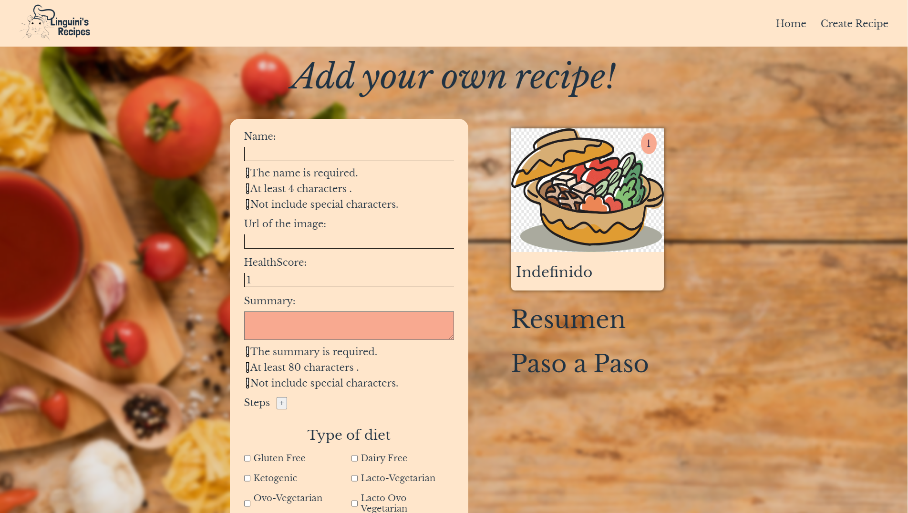
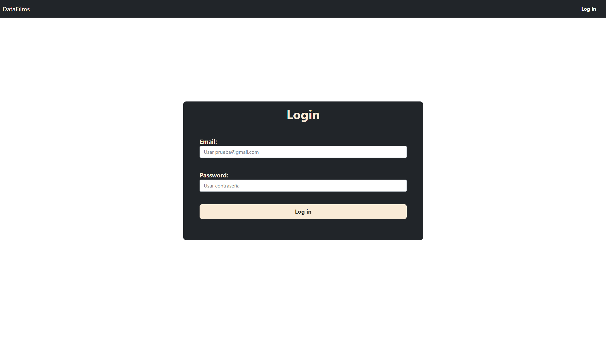
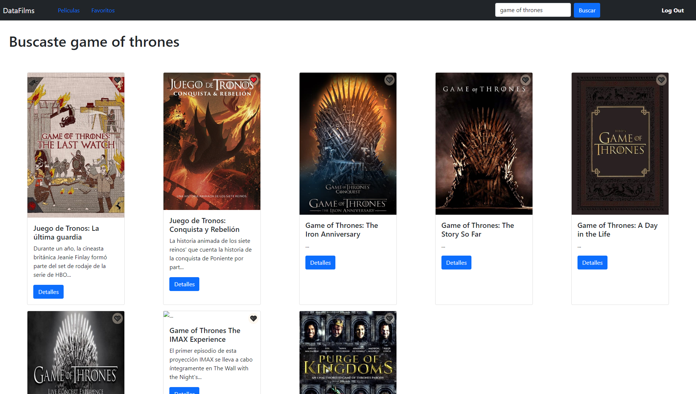
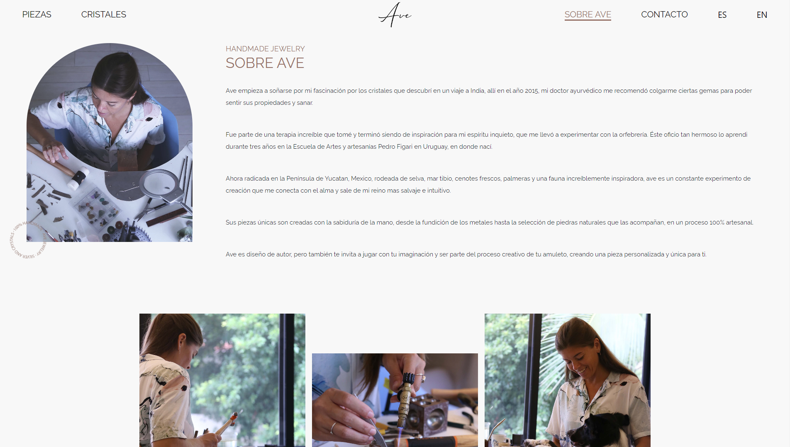

# About Me

Hi, I'm glad you're looking at my profile. Let me tell you that I am a Fullstack developer who started learning a year ago with javascript. Why did I decide to learn it? Because I saw it in series and videos. From that moment I wanted to build my way into the It world. From the beginning until now I realized that this is for me, because I really like to use logic and creativity.
Actually I'm looking for my first experiences and new challenges.

## Technologies

## Proyects

### GameScript

### Linguini Recipes

### DataFilms

### Ave Silver And Crystals

